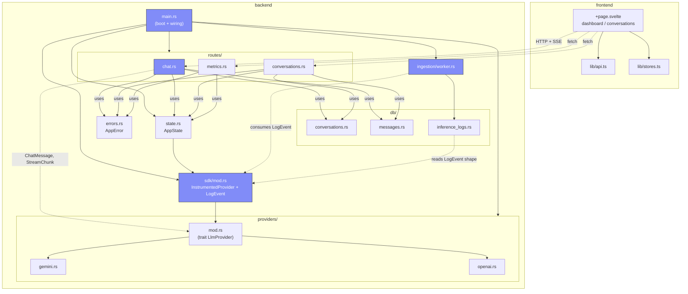
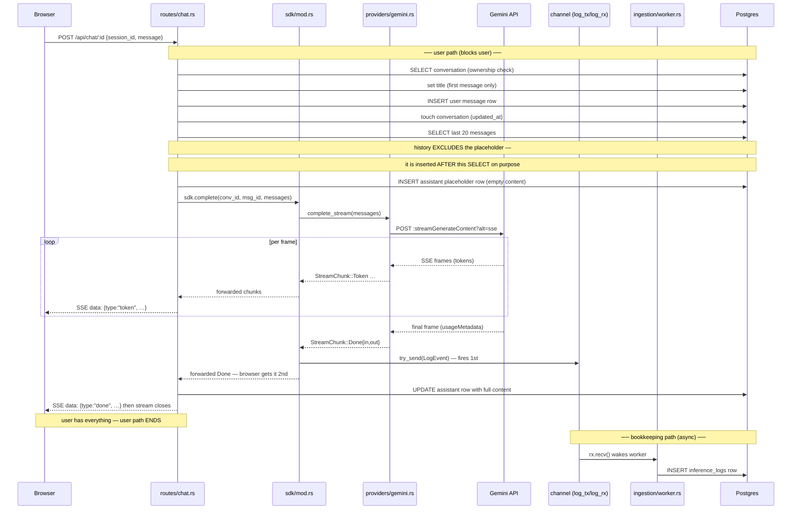

# File map — who talks to whom

Three views: dependency graph (code-level), runtime sequence (one chat message), boot order.

---

## 1. Dependency graph (who imports whom)

---

## 2. One chat message, end to end (sequence)

Three things strictly ordered now:

1. ownership check → title → user insert → touch → history → placeholder → SDK call
2. SDK fires LogEvent to the bus BEFORE forwarding "done" to the browser
3. assistant UPDATE (user path) happens BEFORE stream close; only `inference_logs` INSERT is off-path bookkeeping

**Error variant (same diagram, different branch):** provider returns Err (401/429/503/404) → SDK fires ONE LogEvent with `status="error"` + stored `error_msg` + partial output_preview → forwards error to browser as `{type:"error"}` SSE event → worker writes the row anyway. Errors are telemetry, not just failures.

---

## 3. Boot order (main.rs, top to bottom)

```mermaid
flowchart LR
    A["tokio runtime + env + logger"] --> B["PgPool connect<br/>(10 conns)"]
    B --> C["sqlx::migrate!<br/>3 tables + idx"]
    C --> D["mpsc channel<br/>cap 10_000"]
    D --> E["spawn worker<br/>(bg task, loop forever)"]
    E --> F["pick provider by env<br/>Arc dyn -> openai|gemini"]
    F --> G["InstrumentedProvider<br/>(provider, log_tx)"]
    G --> H["AppState { pool, sdk }"]
    H --> I["Router + cors + trace"]
    I --> J["axum::serve :3001"]
```

Any of steps B–F fails → process refuses to boot (no half-up server).

---

## 4. One-line per file (quick reference)

| File | Plain-English job | Touches |
|---|---|---|
| `main.rs` | assembly line: connects everything | everything |
| `state.rs` | the bag handed to every handler (pool + sdk) | sdk |
| `errors.rs` | converts errors → HTTP status + JSON | axum only |
| `providers/mod.rs` | neutral language: ChatMessage, StreamChunk, trait | futures, serde |
| `providers/gemini.rs` | knows how Google speaks (roles, SSE frames, usage) | reqwest |
| `providers/openai.rs` | knows how OpenAI speaks | reqwest |
| `sdk/mod.rs` | accountant: wraps calls, fires ONE LogEvent per call | providers/, channel |
| `ingestion/worker.rs` | mailbox collector: drains channel → one INSERT per event | db/, channel |
| `db/conversations.rs` | SQL for conversations table | sqlx |
| `db/messages.rs` | SQL for messages (incl. pre-generated IDs) | sqlx |
| `db/inference_logs.rs` | SQL for logs — worker-only | sqlx |
| `routes/chat.rs` | the orchestrator of one turn (verify→save→history→call→stream) | state, db, sdk |
| `routes/conversations.rs` | CRUD for conversations | state, db |
| `routes/metrics.rs` | 3 read-only aggregate SELECTs | state |
| `frontend/lib/api.ts` | typed fetch client + manual SSE parser | backend |
| `frontend/lib/stores.ts` | session UUID in localStorage | browser |
| `frontend/+page.svelte` | chat UI + composer + markdown + autoscroll | api.ts |
| `frontend/conversations/+page.svelte` | list + resume | api.ts |
| `frontend/dashboard/+page.svelte` | cards + chart + table, 5s poll | api.ts |
