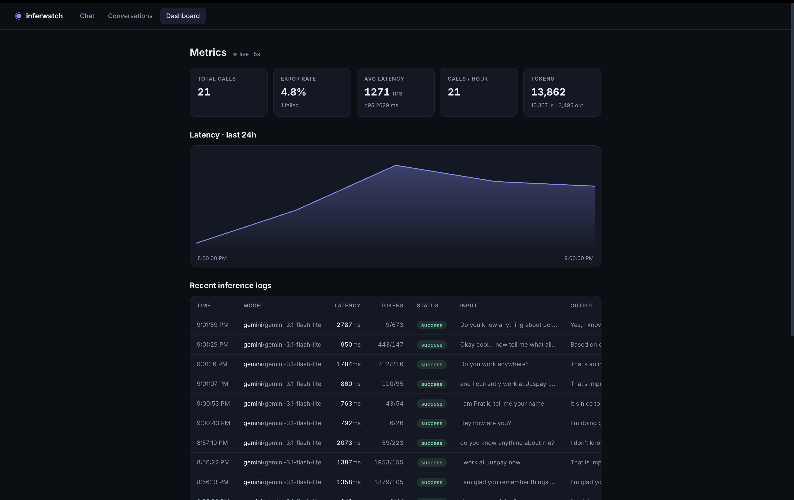
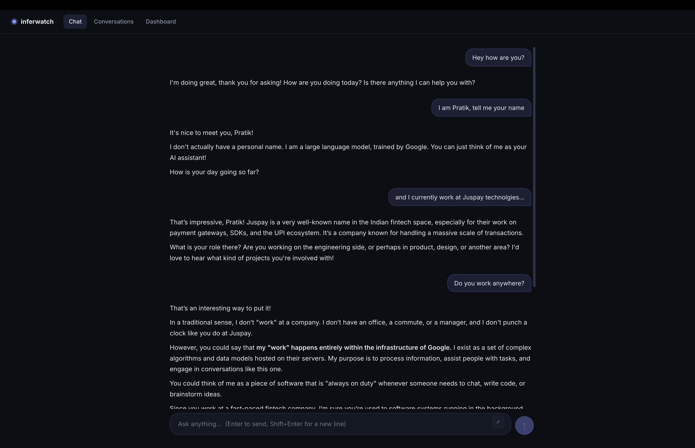
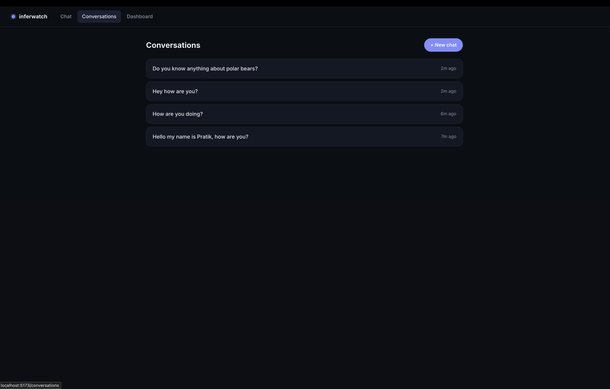
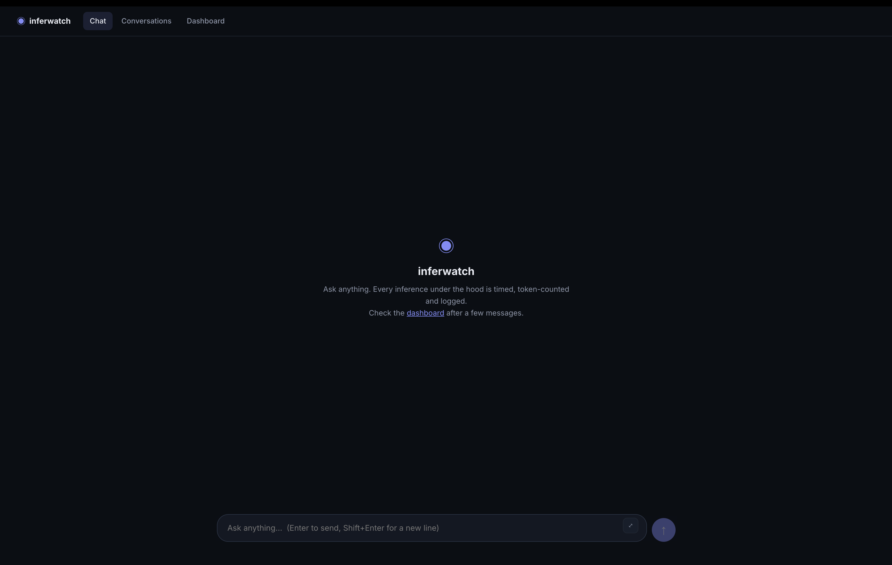

# inferwatch

**LLM chatbot + auto-instrumented inference logging + ingestion pipeline.**

A working chat app is just the vehicle — the real system observes every LLM call, captures structured telemetry (latency, tokens, model, provider, status) without the request path noticing, and stores it reliably. Ships with a live metrics dashboard.

**Stack:** Rust (Axum + Tokio + SQLx) · SvelteKit (TS) · PostgreSQL · Docker Compose · Gemini/OpenAI (env-swappable)

---

## Demo

🎥 **[Watch the demo video](docs/DemoVideo.mp4)** — streaming chat → live dashboard → error telemetry captured (a real failed call from a bad API key).

| Live dashboard | Chat with memory |
|---|---|
|  |  |
| **Conversations** (persist + resume) | **Fresh chat** (⌄ welcome screen, composer) |
|  |  |

---

## Quick start

### One command (Docker)

```bash
GEMINI_API_KEY=your_key docker compose up --build
```

opens:
- chat UI → http://localhost:5173
- dashboard → http://localhost:5173/dashboard
- API → http://localhost:3001/health

> **Prerequisites:** Docker (Desktop or colima) running — nothing else to install. Host ports used:
> - **5433** — Postgres (only for inspecting the DB from your host, e.g. `psql -h localhost -p 5433 -U postgres inferwatch`; the app itself uses the internal network). Overridable: `DB_PORT=15432 docker compose up`
> - **3001** — backend API (pinned — the frontend image is built against it)
> - **5173** — frontend. Overridable: `FRONTEND_PORT=8080 docker compose up`
>
> If a port is taken, compose fails with `Bind for 0.0.0.0:XXXX failed: port is already allocated` — free it or use the override var.

Switch LLM providers with no code change:

```bash
LLM_PROVIDER=openai OPENAI_API_KEY=your_key docker compose up --build
```

### Local development

Only needed if you want to hack on the code outside containers. Requires on your machine:
**Rust** ([rustup.rs](https://rustup.rs), stable) · **Node ≥ 20** · **Postgres ≥ 14** · sqlx-cli not needed (offline metadata committed).

```bash
# 1. postgres
brew services start postgresql@14
createdb inferwatch

# 2. backend (migrations run automatically at startup)
cd backend
cp .env.example .env   # fill GEMINI_API_KEY (free: aistudio.google.com)
cargo run              # http://localhost:3001

# 3. frontend
cd frontend
npm install && npm run dev   # http://localhost:5173
```

---

## API reference

| Method | Path | Purpose |
|---|---|---|
| GET | /health | liveness |
| POST | /api/conversations | create `{session_id}` |
| GET | /api/conversations?session_id=… | list mine |
| GET | /api/conversations/:id?session_id=… | one + messages (resume) |
| POST | /api/chat/:conversation_id | `{session_id,message}` → SSE stream |
| GET | /api/metrics/summary | totals, error rate, avg/p95 latency, tokens, calls/h |
| GET | /api/metrics/latency | 5-min buckets × 24h |
| GET | /api/logs | latest 100 inference rows |

SSE event shapes: `{"type":"token","content":…}`, `{"type":"done","message_id":…,…tokens}`, `{"type":"error","message":…}`.

---

## Documentation

- **[ARCHITECTURE.md](./ARCHITECTURE.md)** — system design, ingestion flow, schema decisions, tradeoffs, failure handling, scaling
- **[FILE_MAP.md](./FILE_MAP.md)** — file-level dependency map (mermaid) + request lifecycle sequence diagram
